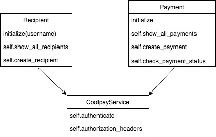

# Coolpay API Tech Test
## Scenario

Coolpay is a new company that allows to easily send money to friends through their API.

You work for Fakebook, a successful social network. You’ve been tasked to integrate Coolpay inside Fakebook. A/B tests show that users prefer to receive money than pokes!

You can find Coolpay documentation here: http://docs.coolpayapi.apiary.io/

You will write a small app that uses Coolplay API in Ruby. The app should be able do the following:

- Authenticate to Coolpay API
- Add recipients
- Send them money
- Check whether a payment was successful

## User Stories

```
As a User,
So that I can make payments on Fakebook using the Coolpay API,
I would like to be able to authenticate to Coolpay.
```

```
As a User,
So that Coolpay knows which people I am going to pay,
I would like to be able to create a recipient.
```

```
As a User,
So that I can send money to recipients,
I would like to be able to create a payment.
```

```
As a User,
So that I can check that whether a transaction went as intended,
I would like to be able to check whether a payment was successful.
```
## Domain Model


## How to use this app

1.) Clone this repo

3.) Install bundler gem if you don't already have it. Then run ```bundle install``` to install dependencies.

3.) Create your own .env file in the root of the project, and in this file set your own valid username and api_key environment variables for the Coolpay API like so:
```
USERNAME=yourusername
APIKEY=yourapikey
```
4.) To run the tests run ```rspec``` in the command line from the root of the project.

4.) To see the app in action, run ```rackup``` and head to http://localhost:9292/

## Issues and Concerns

#### 1.) Many Commits not on green

Feature tests were used to guide the design process in this app and so each class and their methods were test driven and committed while the feature tests were still failing. I know this is bad practice but I was conscious of not making my git commits to large, and was also struggling with my overall design. Perhaps a more in-to-out, unit-test-first approach would have been suitable than a half-hearted out-to-in feature-test-first style.

#### 2.) Feature tests commented out

Once the necessary logic was implemented to get a feature working as I had intended, I commented out the feature tests as I hadn't mocked API calls in them, only in the unit tests. I did not want real calls to the Coolpay API to be made every time I ran rspec. This has meant there are several untested lines of code in app.rb, and the overall test coverage is only 89.29%.

#### 3.) Authentication to Coolpay happens in every method

I was not sure if/when authentication tokens expire so I decided to authenticate in every request made to Coolpay. I am not sure whether this is a sensible thing to do.  
